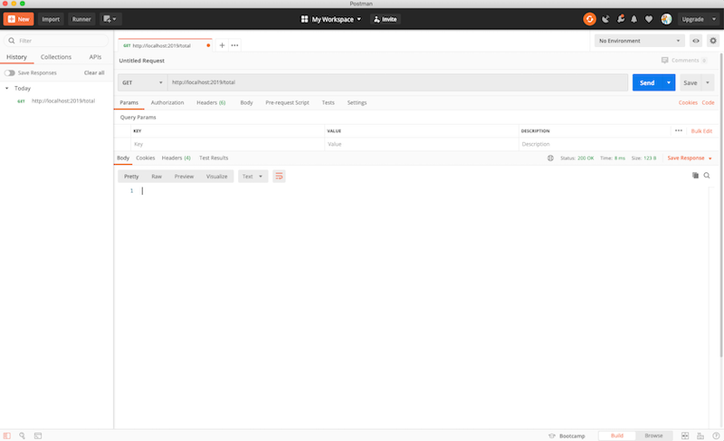

# WEB Java Fundamentals Sprint Challenge

**Read these instructions carefully. Understand exactly what is expected _before_ starting this Sprint Challenge.**

This challenge allows you to practice the concepts and techniques learned over the past sprint and apply them in a concrete project. This sprint explored **Java Fundamentals**. During this sprint, you studied **Java Fundamentals*. In your challenge this week, you will demonstrate your mastery of these skills by creating **a Java Spring Database Application using Object Oriented Programming**.

This is an individual assessment. All work must be your own. Your challenge score is a measure of your ability to work independently using the material covered through this sprint. You need to demonstrate proficiency in the concepts and objectives introduced and practiced in preceding days.

You are not allowed to collaborate during the sprint challenge. However, you are encouraged to follow the twenty-minute rule and seek support from your TL if you need direction.

_You have **three hours** to complete this challenge. Plan your time accordingly._

## Introduction

This sprint challenge combines the knowledge from this week's Java Fundamentals lessons to create a Magical Piggy Bank using Java and the Spring Frame. We have a magical "piggy bank" (a piggy bank is the traditional name of a place to store coins, bills, money). The piggy bank is magical because it can hold unlimited amounts of money. However, you can not get the money out of it.

### Commits

Commit your code regularly and meaningfully. This helps both you (in case you ever need to return to old code for any number of reasons) and your team lead as the evaluate your solution.

## Interview Questions

Be prepared to demonstrate your understanding of this week's concepts by answering questions on the following topics. You might prepare by writing down your own answers before hand.

1. Explain how you took advantage of Java's Object Oriented approach to solve the sprint challenge.
2. Explain the three steps needed to run a Java application (using the JDK) including what each step does and how those step correlate to running a JavaScript application.
3. Explain how Java being a strongly typed language affected you solution.
4. Can you explain the differences between Abstract Classes and Interfaces including how they are used in your application?

## Instructions

### Task 1: Project Set Up

- [ ] Create a forked copy of this project
- [ ] Clone your OWN version of the repository (Not Lambda's by mistake!)
- [ ] Create a new branch: git checkout -b `<firstName-lastName>`.
- [ ] Start with the provided piggybank application
- [ ] Push commits: `git push -u origin <firstName-lastName>`
- [ ] Implement the project on your newly created `<firstName-lastName>` branch, committing changes regularly

[](https://youtu.be/Bw55xlQGQoQ)

### Task 2: Project Requirements

- [ ] You are to start with the provided initial application.
- This application was created using the wizard in IntelliJ
  - The application is named piggybank
  - You do not need to use services or configuration packages
  - DO NOT CHANGE THE JAVA VERSION IN THE POM.XML FILE!!! Version 11 is needed for CodeGrade.
  - You do need to
    - update the applications.properties configuration file
    - create the necessary packages (at least 3 are needed) and classes
- [ ] Create a model Coin to represent the table for the piggy bank
  - Each row in the table contains: (use the provided data.sql as a guide)
    - The number of coins in this group
    - The face value of the coins in the group
    - The name of a single coin
    - The name of more than one coin
- [ ] Create an endpoint http://localhost:2019/total that prints to console the contents of the Piggy Bank as follows and returns an HTTP Status of OK:

In your console in IntelliJ you should see:

```TEXT
    1 Quarter
    1 Dime
    5 Dollars
    3 Nickels
    7 Dimes
    1 Dollar
    10 Pennies
    The piggy bank holds 7.3
```

In Postman you should see



Note: 7.30 = ( 1 * 0.25) + ( 1 * 0.10) + ( 5 * 1.00) + ( 3 * 0.05) + ( 7 * 0.10) + ( 1 * 1.00) + (10 * 0.10)

Note: that when you have more than 1 coin, the plural of the coin's name is printed.

### Required best practices

- [ ] Consistent naming. Examples: variables, functions, Components, and file/folder organization.
- [ ] Consistent spacing. Examples: line breaks, around arguments and before/after functions.
- [ ] Consistent quotation usage.
- [ ] Spell-check.
- [ ] Schedule time to review, refine and reassess your work.

It is better to submit a challenge that meets [MVP](https://en.wikipedia.org/wiki/Minimum_viable_product) than one that attempts too much and fails.

### Tips and Gotchas

In your solution, it is essential that you follow best practices and produce clean and professional results. You will be scored on your adherence to proper code style and good organization. Schedule time to review, refine, and assess your work and perform basic professional polishing including spell-checking and grammar-checking on your work. It is better to submit a challenge that meets MVP than one that attempts too much and does not.

### Task 3: Stretch Goals

After finishing your required elements, you can push your work further. These goals may or may not be things you have learned in this module but they build on the material you just studied. Time allowing, stretch your limits and see if you can deliver on the following optional goals:

- [ ] Add the ability to remove coins from the piggy bank
  - Prevent taking more coins than present in the piggy bank
  - Coins do not have to be removed in the same quantity that were added. For example based on the main program above, removing 3 dimes would be allowed. The Piggy Bank should adjust appropriately.
  - Just the amount to be removed should be given. The program will figure out which coins to remove.
  - You are to create an endpoint http://localhost:2019/money/{amount} that prints to the console the following (using 1.5 as the amount to remove) and returns an HTTP Status of OK

```TEXT
    $4
    7 Dimes
    $1
    10 Pennies
    The piggy bank holds $5.8
```

  - If the money cannot be removed, the following should be printed to the console and return an HTTP Status of OK

```TEXT
    Money not available
```

## Submission format

Follow these steps for completing your project.

- [ ] Set up your fork on Github to submit via Codegrade, pushing commits to your <firstName-lastName> branch.
